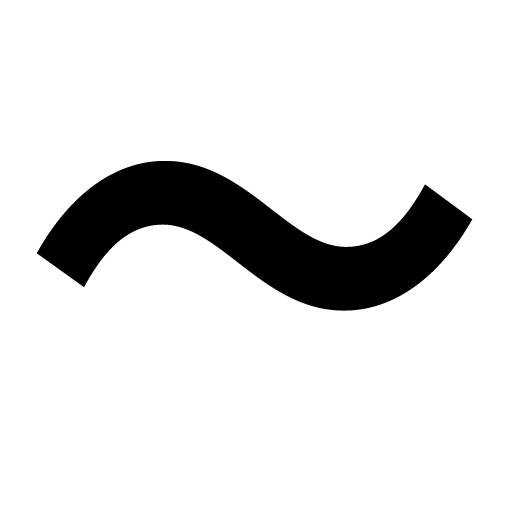

Photon
======

Welcome to the Photon Documentation.

|
|

.. include:: ../Readme.rst

Structure
---------

Photon aimes to be modular and can be divided into :ref:`core`, it's :ref:`backend` and some :ref:`frontend`, provided through :ref:`photon` itself.

.. toctree::
   :maxdepth: 2

   core
   tools
   util

If you just want to use Photon in your Scripts as a normal User you may especially be interested in the parts :ref:`photon` and :ref:`frontend`.

.. rubric:: I am lost:

* :ref:`genindex`
* :ref:`modindex`
* :ref:`search`

.. automodule:: info
    :members:
